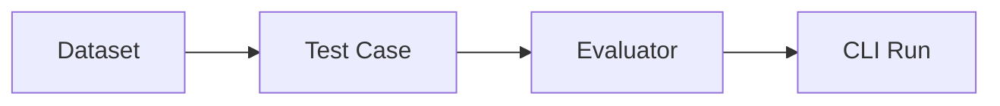

`@m4trix/evals` helps you define datasets, test cases, and evaluators for repeatable AI evaluation runs.













## How it works

1. **Dataset** — Groups test cases by tags and/or file paths
2. **Test Case** — Defines input/output pairs (e.g. prompt + expected score threshold)
3. **Evaluator** — Applies scoring logic to each test case
4. **CLI Run** — Execute evals with `eval-agents-simple run --dataset "..." --evaluator "..."`

## Next steps

- [Setup](/docs/evals/setup) — Installation, config file, and CLI commands
- [Evaluator](/docs/evals/evaluator) — Building evaluators with schemas and metrics
- [Test Case](/docs/evals/test-case) — Defining test cases with tags
- [Dataset](/docs/evals/dataset) — Configuring datasets with tag and path filters
